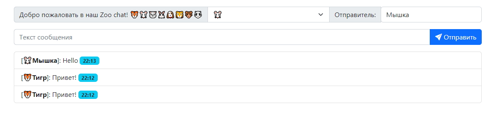

<h3 align="center">Вариант чата</h3>

Чат выполнен при помощи:

- Python 3.10
- Flask 2.2

Чат включает в себя:

- Варианты аватарок
- Строку ввода имени отправителя
- Строку для ввода сообщения

Сообщение состоит из:

- Аватарки
- Имени отправителя
- Текста сообщения
- Времени отправки сообщения
